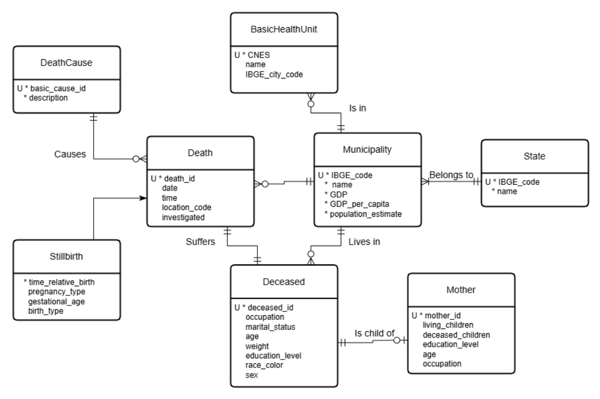

# Postgres Database Project: Brazilian Mortality  

**Course**: MC536 Databases  
**Repository**: Postgres-Database-Project-BrazilianMortality  

---

## Overview  
This repository contains the implementation of a PostgreSQL database for analyzing Brazilian mortality, health, and economic indicators at the municipal and state levels. Data is loaded via Python/psycopg2, with a fully normalized schema and scripts for preprocessing, loading, and querying.

---

## Table of Contents  

- [Overview](#overview)  
- [Team Members](#team-members)  
- [Database Schemas](#database-schemas)  
- [Project Goals](#project-goals)  
- [Datasets](#datasets)  
  - [Raw Data](#raw-data)  
  - [Preprocessed Data](#preprocessed-data)  
- [Technology Stack](#technology-stack)  
- [Project Structure](#project-structure)  
- [Setup and Usage](#setup-and-usage)  
  - [Prerequisites](#prerequisites)  
- [Analysis and Queries](#analysis-and-queries)  
- [Results](#results)

---

## Team Members  
- [**Giovani Mambrim Leme (215041)**](https://github.com/Giovanipt2)  
- [**Pietro Fernandes Magaldi (236842)**](https://github.com/pietromagaldi)  
- [**Adriano Ribeiro F. Campos (173253)**](https://github.com/AdrianoCampos05)  

---

## Database Schemas  
The core of this project is the relational database designed to integrate the different datasets. Below are visualizations of the conceptual and relational models:

### Conceptual Model  
<div align="center">

</div>


### Logical (Relational) Model  
<div align="center">

</div>

---

## Project Goals  
This project aims to implement a PostgreSQL database populated via Python/psycopg2 with Brazilian data on mortality, health, and GDP of cities and states. The main objectives are:

- Design a normalized database schema that captures deaths, causes, basic health units, municipalities, states, and demographic details.  
- Populate the database with preprocessed datasets using automated loading scripts (Jupyter Notebooks).  
- Perform data validation to ensure referential integrity and consistency.  
- Formulate and execute five non-trivial SQL queries to extract insights.

**Non-trivial queries:**  
1. _Estimate population, total deaths, and mortality rate (per 1000) by state_  
2. _Find the most common cause of death (modal cause) for each age_  
3. _Analyze death statistics by GDP per capita decile_  
4. _Get the top 3 causes of death (under age 5) by mother's education level_  
5. _Analyze non-external mortality rates grouped by population per health unit_

---

## Datasets  
### Sources
The data used in was obtained from the following sources:

- [Sistema de Informação sobre Mortalidade – SIM](https://dados.gov.br/dados/conjuntos-dados/sim-1979-2019)
- [Produto Interno Bruto per capita](https://dados.gov.br/dados/conjuntos-dados/cgeo_vw_pib_percapita)
- [Códigos dos municípios IBGE](https://www.ibge.gov.br/explica/codigos-dos-municipios.php)
- [Unidades Básicas de Saúde - UBS](https://dados.gov.br/dados/conjuntos-dados/unidades-basicas-de-saude-ubs2)
- [CID-10](http://www2.datasus.gov.br/cid10/V2008/descrcsv.htm#:~:text=CID%2D10%2DSUBCATEGORIAS.,CID%2DO%2DGRUPOS)
### Raw Data  
The following raw datasets were used and are available in the `datasets/` folder:

- **Mortalidade_Geral_2010.csv**: General mortality records for Brazil in 2010.  
- **vw_pib_percapita.csv**: GDP per capita for Brazilian municipalities (view).  
- **IBGE_cidades_2010.csv**: Municipality names and IBGE city codes.  
- **Unidades_Basicas_Saude-UBS.csv**: Basic Health Unit registry.  
- **CID-10-CATEGORIAS.csv**: ICD-10 categories descriptions.

### Preprocessed Data  
After cleaning and transforming raw inputs, the following files in `preprocessed_datasets/` were loaded into the database (each corresponds to one table in the logical model):

- **Death.csv**  
- **DeathCause.csv**  
- **Deceased.csv**  
- **Mother.csv**  
- **BasicHealthUnit.csv**  
- **State.csv**  
- **Municipality.csv**

---

## Technology Stack  
- **Database**: PostgreSQL (tested with version 14+)  
- **Language**: Python 3.x  
- **Libraries**:  
  - psycopg2-binary: PostgreSQL adapter for Python  
  - pandas: Data manipulation and analysis (used in preprocessing and query result display)  
  - jupyterlab/notebook: For running the `.ipynb` files  
- **Tools**: pgAdmin 4 (for database management and ERD generation)

---

## Project Structure  
```bash
Postgres-Database-Project-BrazilianMortality/
│
├── datasets/  # Original raw datasets
│   ├── Mortalidade_Geral_2010.csv
│   ├── vw_pib_percapita.csv
│   ├── IBGE_cidades_2010.csv
│   ├── Unidades_Basicas_Saude-UBS.csv
│   └── CID-10-CATEGORIAS.csv
│
├── preprocessed_datasets/  # Cleaned CSV files ready for DB import
│   ├── Death.csv
│   ├── DeathCause.csv
│   ├── Deceased.csv
│   ├── Mother.csv
│   ├── BasicHealthUnit.csv
│   ├── State.csv
│   └── Municipality.csv
│
├── models/  # Database model files
│   ├── Conceptual_Model.png
│   └── Logical_Model.png
│
├── queries/  # Individual queries 
│   ├── cause_by_mothers_education.sql
│   ├── death_cause_by_age.sql
│   ├── life_expectancy_by_gdp.sql
│   ├── mortality_by_health_unit_density.sql
│   └── mortality_by_state.sql
│
├── results/  # Output CSV files from analytical queries
│   ├── cause_by_mothers_education.csv
│   ├── death_cause_by_age.csv
│   ├── life_expectancy_by_gdp.csv
│   ├── mortality_by_health_unit_density.csv
│   └── mortality_by_state.csv
│
├── database_creation_and_queries.ipynb  # Jupyter notebook for DB creation, data loading, and querying
├── preprocessing.ipynb  # Jupyter notebook for preprocessing raw data
├── python/  # Python notebooks for workflows
│   ├── preprocessing.ipynb  # Data cleaning and preprocessing
│   ├── tables.ipynb  # Creates DB connection, tables, and loads data
│   └── queries.ipynb  # Contains the five project queries
└── README.md  # This file
```
## Setup and Usage

### Prerequisites
1. Python 3.x
2. PostgreSQL (version 14 or higher)  
3. pip (Python package installer)
4. Required Python libraries:  
```bash
pip install psycopg2-binary pandas jupyterlab ipykernel>=6
```

## Analysis and Queries
Data analysis was done through SQL queries, which can be executed with the [`queries.ipynb`](./python/queries.ipynb) notebook. Each query can also be found separately in [`/queries`](./queries). The queries used were:

1.  [Mortality Rate by State](./queries/mortality_by_state.sql)
2.  [Life Expectancy by GDP per Capita](./queries/life_expectancy_by_gdp.sql)
3.  [Cause of Death by Age](./queries/death_cause_by_age.sql)
4.  [Child Mortality Causes by Mother's Level of Education](./queries/cause_by_mothers_education.sql)
5.  [Mortality by Healthcare Unit Concentration](./queries/mortality_by_health_unit_density.sql)

Further information about each query may be found in the `queries.ipynb` notebook, as well as in their specific `.sql` file.

## Results
The results of each query may be found in CSV format in the [`/results`](./results) directory. To reproduce these results, simply run the [`queries.ipynb`](./python/queries.ipynb) notebook up to the `Executing queries and saving results as csv` section. Don't forget to include the database password in the `Preparations` section.
